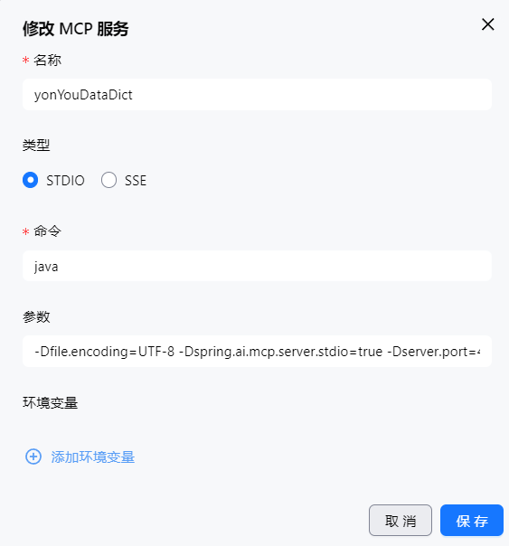

# 用友数据字典 MCP 服务

> ⚠️本项目基于用友对外公开的字典服务搭建，完全出于个人学习目的开发。

## 项目介绍

本项目是一个基于 Spring Boot 3.x 和 Spring AI 构建的 Model Context Protocol (MCP) 服务器，用于访问和查询用友数据字典服务(
目前仅支持YonBIP高级版)。项目提供了标准化的 MCP 接口，可以与支持 MCP 协议的 AI 客户端集成，实现对用友数据字典的智能查询和检索。

## 功能特性

- 🔍 **智能搜索**：支持按名称模糊搜索用友数据字典条目
- 📋 **详情查询**：根据类ID获取完整的数据字典详情信息
- 🚀 **MCP 协议**：完全兼容 Model Context Protocol，可与各种 AI 客户端集成
- 💾 **缓存机制**：内置 LRU 缓存，提升查询性能
- 🐳 **容器化部署**：支持 Docker 和 Docker Compose 部署
- 📊 **健康检查**：集成 Spring Boot Actuator，提供服务健康监控

## 技术栈

- **框架**：Spring Boot 3.5.0
- **Java 版本**：Java 17
- **MCP 支持**：Spring AI MCP Server
- **网络请求**：Spring WebMVC
- **HTML 解析**：Jsoup 1.17.2
- **JSON 处理**：FastJSON 2.0.51
- **容器化**：Docker & Docker Compose

## 快速开始

### 环境要求

- Java 17 或更高版本
- Maven 3.6 或更高版本
- Docker（可选，用于容器化部署）

### Docker 部署

#### 方式一：Docker Compose（推荐）

```bash
# 构建并启动服务
docker-compose up --build -d

# 查看日志
docker-compose logs -f

# 停止服务
docker-compose down
```

#### 方式二：Docker 手动构建

```bash
# 构建镜像
docker build -t yonyou-datadict .

# 运行容器
docker run -d \
  --name yonyou-datadict-app \
  -p 8080:8080 \
  -e SPRING_PROFILES_ACTIVE=prod \
  yonyou-datadict
```

### 手动启动/stdio

#### 方式一：Maven 启动

1. **克隆项目并安装依赖**
   ```bash
   git clone <项目地址>
   cd yonyouDataDict
   ./mvnw clean install
   ```

2. **启动应用**
   ```bash
   ./mvnw spring-boot:run
   ```
   执行命令后默认启动的是sse模式,本机推荐通过标准输入输出,mcp连接更可靠,请向下查看 SSE与STDIO模式

#### 方式二：使用 IDE

1. 导入项目到你的 IDE（IntelliJ IDEA 或 Eclipse）
2. 等待 Maven 依赖下载完成
3. 运行 `YonyouDataDictApplication` 主类

### 验证启动

启动成功后，可以通过以下方式验证：

- **健康检查**：访问 `http://localhost:8080/actuator/health`

## 配置说明

### 应用配置

主要配置位于 `src/main/resources/application.yml`：

```yaml
data-dict:
  base-url: https://media.oyonyou.com:18000/oyonyou/dict  # 用友数据字典服务地址
  static-path: /static/js/data-dict-tree.js              # 静态资源路径
  default-app-code: yonbip3ddc                           # 默认应用代码
  cache-enabled: true                                    # 是否启用缓存
  cache-size: 100                                        # 缓存大小
```

### 生产环境配置

生产环境配置位于 `src/main/resources/application-prod.yml`，可根据需要调整。

## 项目结构

```
src/
├── main/
│   ├── java/win/ixuni/yonyoudatadict/
│   │   ├── YonyouDataDictApplication.java    # 主启动类
│   │   ├── cache/
│   │   │   └── LRUCache.java                # LRU缓存实现
│   │   ├── config/
│   │   │   └── DataDictConfig.java          # 配置类
│   │   ├── controller/
│   │   │   └── healthCheckController.java   # 健康检查控制器
│   │   ├── model/
│   │   │   ├── DataDictDetail.java          # 数据字典详情模型
│   │   │   └── DataDictItem.java            # 数据字典项模型
│   │   ├── processor/
│   │   │   ├── DataDictProcessor.java       # 数据字典处理器接口
│   │   │   └── DefaultDataDictProcessor.java # 默认处理器实现
│   │   ├── service/
│   │   │   ├── DataDictCacheService.java    # 缓存服务
│   │   │   └── DataDictService.java         # 核心业务服务
│   │   └── util/
│   │       └── DataDictDownloader.java      # 数据下载工具
│   └── resources/
│       ├── application.yml                  # 主配置文件
│       └── application-prod.yml             # 生产环境配置
```

## MCP 客户端集成

本服务仅实现了SSE，可以与以下客户端集成：

- Claude Desktop
- 其他支持 MCP 的 AI 客户端

### MCP 客户端配置示例(vsCode)

```json
{
  "mcp": {
    "servers": {
      "yonyou": {
        "type": "sse",
        "url": "http://127.0.0.1:8080/sse"
      }
    }
  }
}
```

## SSE 与 STDIO 模式

本项目提供了基于 HTTP 的 SSE (Server-Sent Events) 以及基于本机进程通信的 STDIO 模式：

- **SSE 模式**：可快速通过 Docker 启动，但网络不稳定时需要重启 MCP 客户端。
- **STDIO 模式**：依赖本机进程通信，连接更稳定，推荐使用。需注意此模式,依然需要占用端口，可通过 `-Dserver.port=xxxx` 进行调整。

### 启动示例

启动stdio需要提前将代码通过maven打成jar包,并记录路径,下面以42661端口,路径yourApp.jar为例

```bash
java -Dfile.encoding=UTF-8 \
     -Dspring.ai.mcp.server.stdio=true \
     -Dserver.port=42661 \
     -jar yourApp.jar
```

idea的通义灵码(参数部分参上面)



vsCode：

打开配置搜索mcp->打开setting.json,新增关于yongyouDataDict的部分

```
 "mcp": {
        "servers": {
            "yonYouDataDict": {
                "type": "stdio",
                "command": "java",
                "args": [
                    "-Dspring.ai.mcp.server.stdio=true",
                    "-Dfile.encoding=UTF-8",
                    "-jar",
                    "E:\\xxxx.jar"
                ]
            }
        }
    },
```

> 如果搜索英文有返回但中文搜索无结果，请务必添加 `-Dfile.encoding=UTF-8` 选项。

## 常见问题

### Q: 服务启动失败怎么办？
A: 请检查：
- Java 版本是否为 17 或更高
- 网络连接是否正常（需要访问用友服务）
- 端口是否被占用
- 用友的家人们基本都会java,自己看看代码,修修就行了

### Q: 缓存如何清理？

A: 重启应用会自动清理内存缓存.系统运行中如果超过了允许的最大缓存个数,会自动清理最久未使用的缓存

### Q: 如何修改数据源？
A: 目前基于www.oyonyou.com 抓包的url,如果情况特殊,可以修改`application.yml` 中的 `data-dict.base-url` 配置。

### Q: 现在查看的是2312的,我想让AI查看NC65的,如何操作？

A: 目前https://www.oyonyou.com/dict/yonbip3ddcr5/ 访问这个打开的是2312的字典,暂称yonbip3ddcr5为应用code,那么在application中设置
default-app-code 为 yonbip3ddcr5 即为访问2312的字典,NC65的同理,替换应用code为 ncddc0065 即可(
目前仅支持高级版,nc65只是举例)
## 贡献

欢迎提交 Issue 和 Pull Request！

## 联系方式

如有问题，请通过 GitHub Issues 联系. 非bug不处理

如有建议,请通过邮箱:maolei01@yonyou.com 联系。
> 邮箱联系时,请使用yonyou邮箱联系